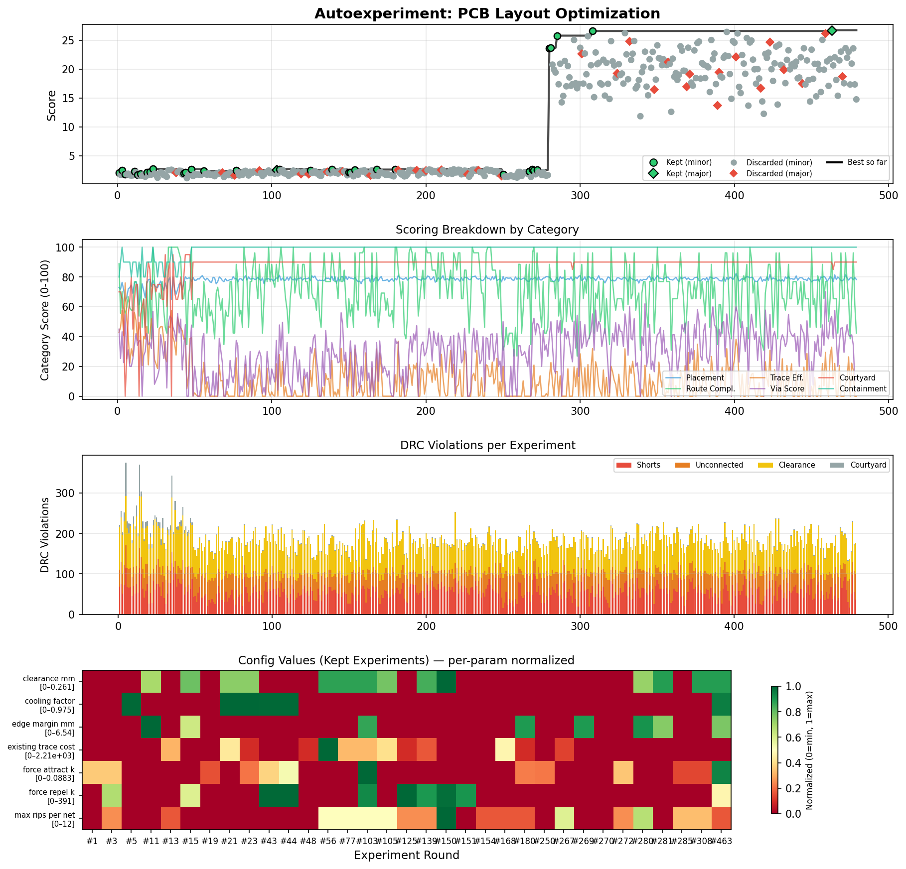
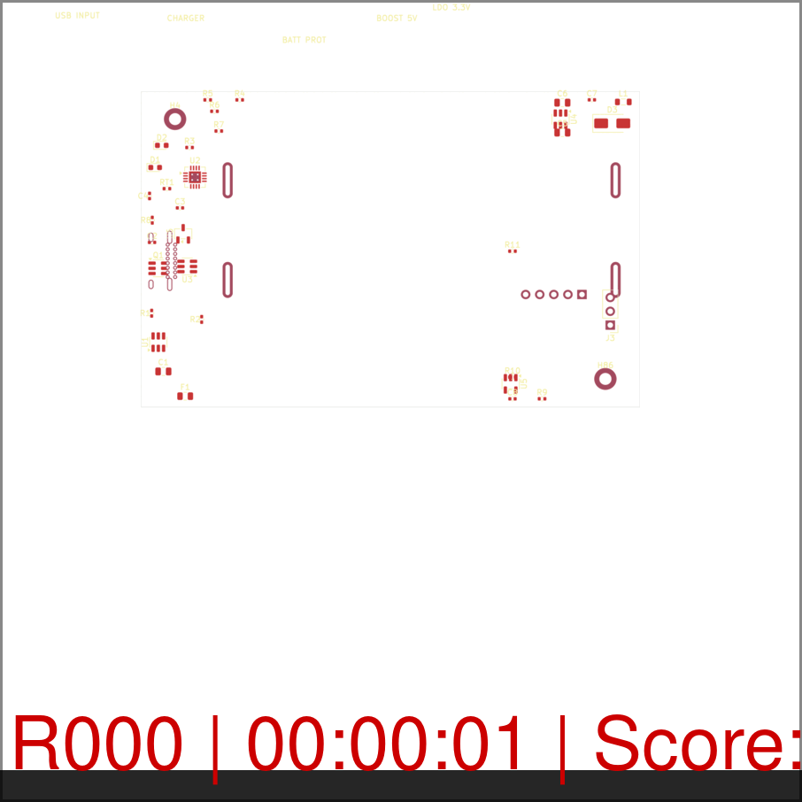

# LLUPS — Lithium Li-ion Universal Power Supply

> **Status: Draft / Untested** — Schematic and layout are procedurally generated and have not been fabricated or validated on hardware. Review all design choices and run DRC before ordering boards.

A compact PCB module providing regulated 5V and 3.3V power from two 18650 Li-ion cells (1S2P), charged via USB-C with passthrough capability.

## Specs

| Parameter | Value |
|---|---|
| Cells | 2x 18650 in parallel (1S2P), 3.7V nominal |
| Input | USB-C 5V (default power, no PD) |
| Outputs | 5V @ 1A (boost), 3.3V @ 500mA (LDO), raw VBAT |
| Charger | BQ24072, 1-2A CC/CV with power path |
| Protection | HY2113 (2.8V hard cutoff) + LN61C supervisor (3.3V operating cutoff) |
| Boost | MT3608, 5V from 3.3-4.2V input |
| LDO | AP2112K-3.3, 600mA |
| Board | 90×58mm default (variable with `--board-size-search`), 2-layer, 1oz Cu |

## Core Files

```text
LLUPS.kicad_pro          # KiCad 9 project
LLUPS.kicad_sch          # Schematic
LLUPS.kicad_pcb          # PCB layout
generate_project.py      # Regenerates project artifacts
spec.md                  # Design specification
BOM.csv / BOM.xlsx       # Bill of materials
```

## Regenerating

```bash
python3 generate_project.py
```

Requires KiCad 9 CLI tools (`kicad-cli`) for netlist export.

## Running the Optimizer

```bash
python3 .claude/skills/kicad-helper/scripts/autoexperiment.py LLUPS.kicad_pcb --rounds 100
```

The optimizer iterates placement and routing, keeping candidates that improve the overall score and discarding the rest. The best layout is saved to `LLUPS_best.kicad_pcb`.

### Search Space Flags

| Flag | Effect |
|---|---|
| `--unlock-all` | Unlock all footprints (batteries, connectors, mounting holes) — edge scoring still incentivizes edge placement |
| `--board-size-search` | Add board width (60–120mm) and height (40–80mm) to the parameter search space (5mm steps) |

```bash
# Full exploration: unlock all footprints + vary board size over 150 rounds
python3 .claude/skills/kicad-helper/scripts/autoexperiment.py LLUPS.kicad_pcb \
  --rounds 150 --unlock-all --board-size-search
```

## Experiment Manager GUI

A standalone NiceGUI web app for configuring, running, monitoring, and analyzing experiments.

```bash
# Install dependencies (first time only)
pip install nicegui sqlalchemy plotly scipy

# Launch the GUI
python3 -m gui
# then open http://localhost:8080
```

### GUI Tabs

| Tab | Purpose |
|---|---|
| **Setup** | Configure search dimensions, mutation strategy, score weights, feature toggles (unlock all, board size search), and save/load presets |
| **Monitor** | Start/stop experiments, live score chart, status cards, round-by-round progress |
| **Analysis** | Browse past experiments, score trend plots, parameter sensitivity (Spearman), correlation matrix, convergence analysis, CSV export |
| **Board** | PCB layout viewer with layer selection and component list |

Experiment data is stored in `.experiments/llups.db` (SQLite). Existing JSONL logs are auto-imported on first launch.

## Monitoring Your Run

> All monitoring is read-only — it reads output files and never interferes with the experiment. Zero performance impact.

**During a run** — pick any of these (in a second terminal):

```bash
# Experiment Manager GUI (recommended — includes live charts + analysis)
python3 -m gui

# Or: one-line terminal status
watch -n2 cat .experiments/run_status.txt

# Or: leave the HTML report open; it rebuilds after each round and refreshes itself
xdg-open report.html
```

**After a run:**

```bash
# Animated layout evolution
xdg-open .experiments/progress.gif

# Score dashboard (PNG)
xdg-open .experiments/experiments_dashboard.png

# Interactive HTML report (richest view; rebuilt live during the run and finalized at the end)
python3 .claude/skills/kicad-helper/scripts/generate_report.py .experiments/ -o report.html
xdg-open report.html
```

Full details on every artifact, the web dashboard, the HTML report sections, DRC overlays, failure heatmaps, dependencies, and troubleshooting: [`docs/monitoring-guide.md`](docs/monitoring-guide.md)




## Architecture & Scoring

- [`docs/architecture.md`](docs/architecture.md) — system diagrams and layer responsibilities
- [`docs/footprint-layout.md`](docs/footprint-layout.md) — placement engine details
- [`docs/auto-trace.md`](docs/auto-trace.md) — routing engine details
- [`docs/scoring.md`](docs/scoring.md) — scoring formulas and weight breakdowns
- [`docs/monitoring-guide.md`](docs/monitoring-guide.md) — reports, dashboard, and monitoring

Static QA score (independent of the optimizer):

```bash
python3 .claude/skills/kicad-helper/scripts/score_layout.py LLUPS.kicad_pcb
```

## KiCad Helper Scripts

Automation scripts using the KiCad 9 `pcbnew` Python API:

| Script | Purpose |
|---|---|
| `list_footprints.py` | List components with positions |
| `check_trace_widths.py` | Find traces below minimum width |
| `run_drc.py` | Report DRC markers |
| `net_report.py` | List nets and pad counts |
| `move_component.py` | Move a footprint to X,Y |
| `arrange_grid.py` | Arrange components in a grid |
| `align_components.py` | Align components along an axis |

All in `.claude/skills/kicad-helper/scripts/`.

## Subcircuits Workflow

The hierarchical/subcircuits redesign is currently focused on a real leaf-first routing flow:

1. parse the true schematic hierarchy from `LLUPS.kicad_sch`
2. extract each leaf sheet into a local board state
3. stamp a real KiCad leaf board under `.experiments/subcircuits/<slug>/`
4. validate the stamped pre-route leaf board before routing
5. route the leaf through the real FreeRouting path
6. validate the routed leaf artifact before accepting it
7. persist accepted routed copper canonically in `solved_layout.json`

Current verification command:

```bash
python3 .claude/skills/kicad-helper/scripts/solve_subcircuits.py LLUPS.kicad_sch \
  --pcb LLUPS.kicad_pcb \
  --rounds 1 \
  --route
```

### Leaf render diagnostics

Each leaf artifact may now include a small visual diagnostic bundle under:

```text
.experiments/subcircuits/<slug>/renders/
```

These diagnostics are intended for debugging real stamped/routed leaf boards, not for demo polish. The preferred artifact set is:

- `pre_route_copper_both.png`
- `pre_route_front_all.png`
- `pre_route_drc.json`
- `pre_route_drc_overlay.png` when coordinate-bearing violations exist
- `routed_copper_both.png`
- `routed_front_all.png`
- `routed_drc.json`
- `routed_drc_overlay.png` when coordinate-bearing violations exist
- `pre_vs_routed_contact_sheet.png`

This makes it easier to answer:

- is the stamped pre-route leaf board already illegal?
- are footprints or edge-coupled connectors misaligned to `Edge.Cuts`?
- did FreeRouting add meaningful copper?
- did routing improve or worsen the board visually?

### Current subcircuits blocker

The current blocker on `feature/sub-circuits-redesign` is that at least one LLUPS leaf reaches real stamped KiCad board export and visible FreeRouting activity, but the stamped `leaf_pre_freerouting.kicad_pcb` is still illegal before routing begins. In practice, this means the next debugging target is preserving source-board edge relationships for edge-pinned parts, rather than treating routed copper as the first failure.

## License

GPLv3 — see [LICENSE](LICENSE).
