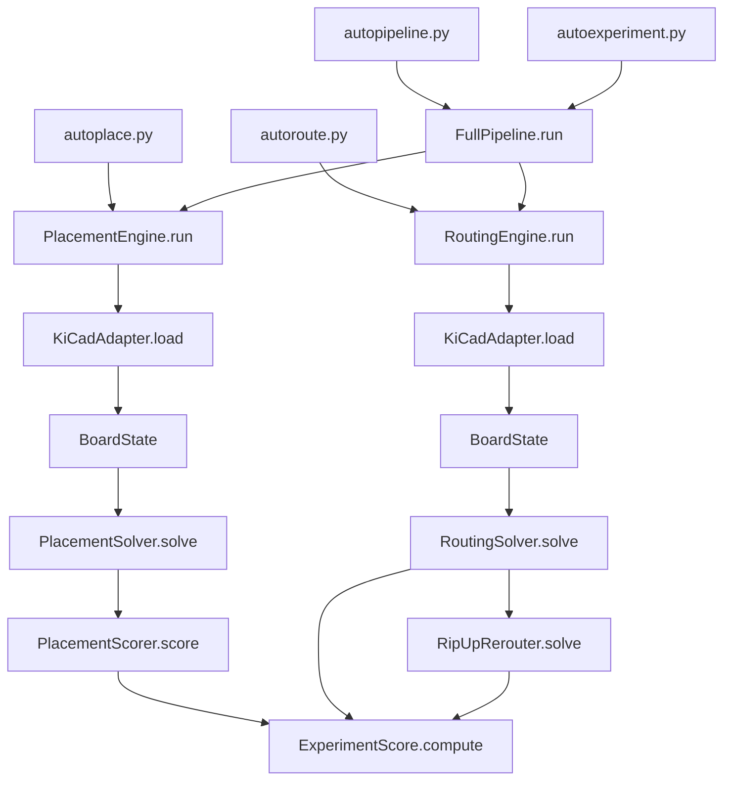
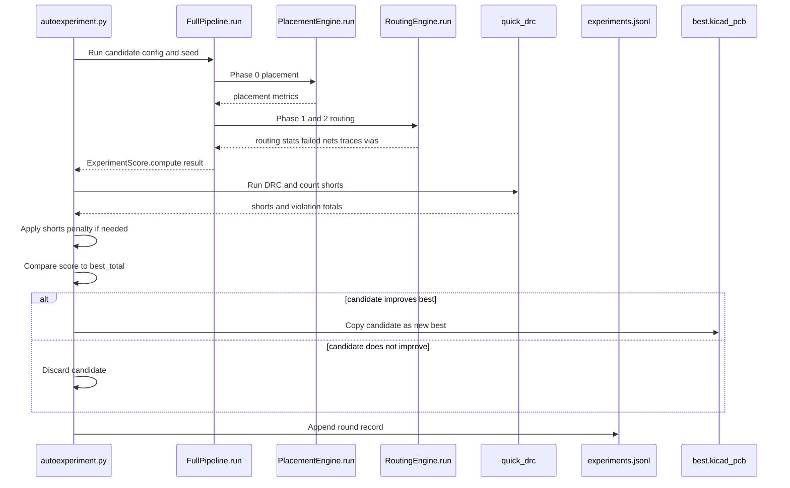

# LLUPS — Lithium Li-ion Universal Power Supply

> **Status: Draft / Untested** — Schematic and layout are procedurally generated and have not been fabricated or validated on hardware. Review all design choices and run DRC before ordering boards.

A compact PCB module providing regulated 5V and 3.3V power from two 18650 Li-ion cells (1S2P), charged via USB-C with passthrough capability.

## Specs

| Parameter | Value |
|---|---|
| Cells | 2x 18650 in parallel (1S2P), 3.7V nominal |
| Input | USB-C 5V (default power, no PD) |
| Outputs | 5V @ 1A (boost), 3.3V @ 500mA (LDO), raw VBAT |
| Charger | BQ24072, 1-2A CC/CV with power path |
| Protection | HY2113 (2.8V hard cutoff) + LN61C supervisor (3.3V operating cutoff) |
| Boost | MT3608, 5V from 3.3-4.2V input |
| LDO | AP2112K-3.3, 600mA |
| Board | 90x58mm, 2-layer, 1oz Cu |

## Core Files

```text
LLUPS.kicad_pro          # KiCad 9 project
LLUPS.kicad_sch          # Schematic
LLUPS.kicad_pcb          # PCB layout
generate_project.py      # Regenerates project artifacts
spec.md                  # Design specification
BOM.csv / BOM.xlsx       # Bill of materials
```

## Regenerating

```bash
python3 generate_project.py
```

Requires KiCad 9 CLI tools (`kicad-cli`) for netlist export.

## Experiment Dashboard (Current Run State)

Run the autonomous optimizer:

```bash
cd .claude/skills/kicad-helper/scripts
python3 autoexperiment.py ../../../../LLUPS.kicad_pcb --rounds 50
```

This produces:

- `.experiments/experiments.jsonl` (round-by-round history)
- `.experiments/experiments_dashboard.png` (score and metrics dashboard)
- `.experiments/progress.gif` (layout evolution)
- `.experiments/run_status.json` and `.experiments/run_status.txt` (live status)
- `.experiments/best/best.kicad_pcb` (best candidate)


## Architecture (Code-Truth Overview)



### One Experiment Round (Sequence)



Detailed diagrams and subsystem explanations:

- [`docs/architecture.md`](docs/architecture.md)
- [`docs/footprint-layout.md`](docs/footprint-layout.md)
- [`docs/auto-trace.md`](docs/auto-trace.md)
- [`docs/scoring.md`](docs/scoring.md)
- [`docs/dashboard-automation.md`](docs/dashboard-automation.md)

## Scoring Framework

There are two different scoring paths in this repo.

### 1) Static QA scorer (`score_layout.py`)

Run:

```bash
python3 .claude/skills/kicad-helper/scripts/score_layout.py LLUPS.kicad_pcb
```

This computes weighted check categories (trace width, DRC, connectivity, placement, via analysis, routing efficiency, plus advisory checks).

### 2) Experiment optimizer objective (`autoexperiment.py`)

Used for keep/discard decisions in optimization loop (`ExperimentScore.compute()` + shorts penalty):

```text
route_pct = ((total_nets - failed_nets) / total_nets) * 100    # if total_nets > 0 else 100
via_score = clamp(100 - (via_count / routed_nets)*20, 0..100)  # if routed_nets > 0 else 50

raw =
  0.15*placement_total +
  0.65*route_pct +
  0.10*via_score +
  0.10*50

final = raw * (board_containment / 100)

if shorts > 0:
  final *= 1 / (1 + log10(1 + shorts))
```

Placement sub-score weights (`PlacementScore.compute_total()`):

- `net_distance`: 0.25
- `crossover_score`: 0.30
- `compactness`: 0.02
- `edge_compliance`: 0.05
- `rotation_score`: 0.03
- `board_containment`: 0.20
- `courtyard_overlap`: 0.15

## Quick Commands

```bash
# Run experiment loop
python3 .claude/skills/kicad-helper/scripts/autoexperiment.py LLUPS.kicad_pcb --rounds 50

# Rebuild dashboard from JSONL
python3 .claude/skills/kicad-helper/scripts/plot_experiments.py .experiments/experiments.jsonl .experiments/experiments_dashboard.png

# Static QA score
python3 .claude/skills/kicad-helper/scripts/score_layout.py LLUPS.kicad_pcb
```

## Logging and Monitoring

### Structured Logging

The experiment system includes structured logging for debugging and tracking progress:

```bash
# Enable logging (default is INFO level)
python3 .claude/skills/kicad-helper/scripts/autoexperiment.py LLUPS.kicad_pcb --log-level DEBUG

# Logs are written to .experiments/debug.log
tail -f .experiments/debug.log
```

Log events (INFO level):
- `experiment_started` - experiment configuration
- `baseline_complete` - baseline run results
- `new_best` - when best score improves
- `round_discarded` - when round doesn't improve
- `experiment_completed` - final results
- `experiment_failed` - errors with traceback

### Web Dashboard

A Flask-based dashboard provides live monitoring and control:

```bash
# Start the dashboard daemon
python3 .claude/skills/kicad-helper/scripts/dashboard_app.py --port 5000

# Open in browser
http://localhost:5000
```

Dashboard features:
- Live status (round progress, best score, kept count)
- Score history chart (auto-updating)
- Round-by-round table
- Log viewer
- Start/Stop controls

The dashboard runs as a separate daemon - it reads from experiment output files (read-only) and has zero performance impact on running experiments.

## KiCad Helper Scripts

Automation scripts using the KiCad 9 `pcbnew` Python API:

| Script | Purpose |
|---|---|
| `list_footprints.py` | List components with positions |
| `check_trace_widths.py` | Find traces below minimum width |
| `run_drc.py` | Report DRC markers |
| `net_report.py` | List nets and pad counts |
| `move_component.py` | Move a footprint to X,Y |
| `arrange_grid.py` | Arrange components in a grid |
| `align_components.py` | Align components along an axis |

All in `.claude/skills/kicad-helper/scripts/`.

## License

GPLv3 — see [LICENSE](LICENSE).
