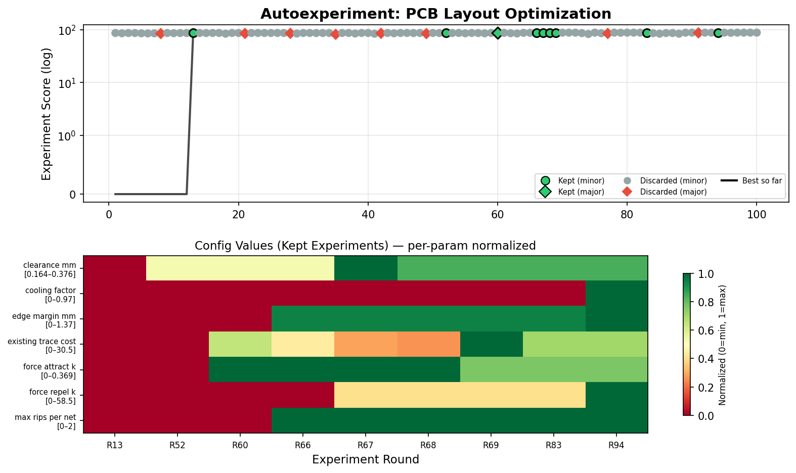

# LLUPS — Lithium Li-ion Universal Power Supply

> **Status: Draft / Untested** — Schematic and layout are procedurally generated and have not been fabricated or validated on hardware. Review all design choices and run DRC before ordering boards.

A compact PCB module providing regulated 5V and 3.3V power from two 18650 Li-ion cells (1S2P), charged via USB-C with passthrough capability.

## Specs

| Parameter | Value |
|---|---|
| Cells | 2x 18650 in parallel (1S2P), 3.7V nominal |
| Input | USB-C 5V (default power, no PD) |
| Outputs | 5V @ 1A (boost), 3.3V @ 500mA (LDO), raw VBAT |
| Charger | BQ24072, 1-2A CC/CV with power path |
| Protection | HY2113 (2.8V hard cutoff) + LN61C supervisor (3.3V operating cutoff) |
| Boost | MT3608, 5V from 3.3-4.2V input |
| LDO | AP2112K-3.3, 600mA |
| Board | 90x58mm, 2-layer, 1oz Cu |

## Files

```
LLUPS.kicad_pro          # KiCad 9 project
LLUPS.kicad_sch          # Schematic
LLUPS.kicad_pcb          # PCB layout with routed traces
generate_project.py      # Generates all KiCad files from spec
spec.md                  # Full design specification
BOM.csv / BOM.xlsx       # Bill of materials
```

## Regenerating

The entire project (schematic, PCB, traces) is procedurally generated:

```bash
python3 generate_project.py
```

Requires KiCad 9 CLI tools (`kicad-cli`) for netlist export.

## Scoring Framework

A test suite scores PCB layout quality across 8 categories:

```bash
python3 .claude/skills/kicad-helper/scripts/score_layout.py LLUPS.kicad_pcb
```

Categories: trace widths, DRC, connectivity, placement, vias, routing efficiency. Results are saved as timestamped JSON in `scripts/results/` for regression tracking.

Compare runs:

```bash
python3 .claude/skills/kicad-helper/scripts/score_layout.py LLUPS.kicad_pcb \
  --compare .claude/skills/kicad-helper/scripts/results/score_PREV.json
```

## Autonomous Experiment Loop

Run layout optimization offline — no AI tokens, just CPU time:

```bash
cd .claude/skills/kicad-helper/scripts

# Run 50 rounds of placement+routing experiments
python3 autoexperiment.py ../../../../LLUPS.kicad_pcb --rounds 50

# Run overnight with longer plateau tolerance
python3 autoexperiment.py ../../../../LLUPS.kicad_pcb --rounds 500 --plateau 8

# Custom output and verbose logging
python3 autoexperiment.py ../../../../LLUPS.kicad_pcb -n 100 -o best.kicad_pcb -v
```

Edit `program.md` to steer the search space (parameter ranges, scoring weights).
Results log to `.experiments/experiments.jsonl`. Plot results:

```bash
python3 plot_experiments.py ../../../../.experiments/experiments.jsonl
```



## KiCad Helper Scripts

Automation scripts using the KiCad 9 `pcbnew` Python API:

| Script | Purpose |
|---|---|
| `list_footprints.py` | List components with positions |
| `check_trace_widths.py` | Find traces below minimum width |
| `run_drc.py` | Report DRC markers |
| `net_report.py` | List nets and pad counts |
| `move_component.py` | Move a footprint to X,Y |
| `arrange_grid.py` | Arrange components in a grid |
| `align_components.py` | Align components along an axis |

All in `.claude/skills/kicad-helper/scripts/`.

## License

GPLv3 — see [LICENSE](LICENSE).
