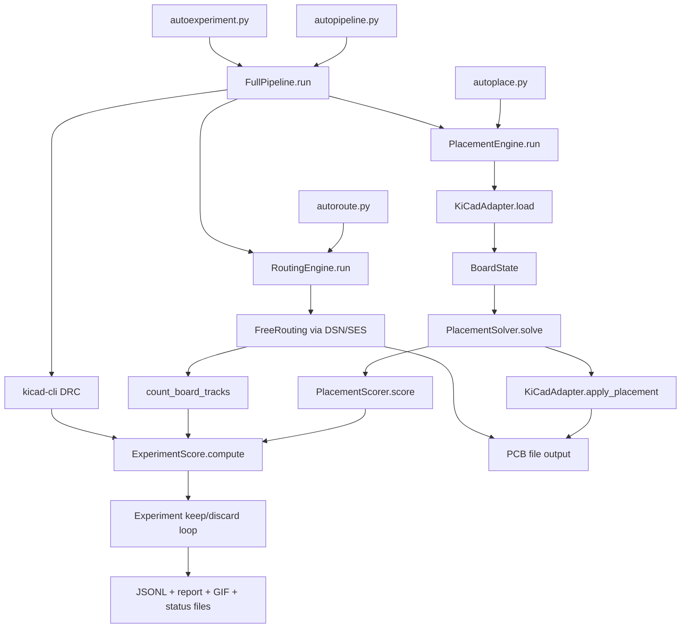
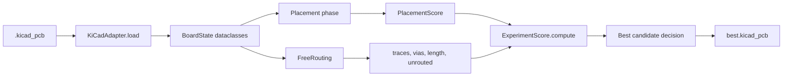

# LLUPS Autoplacer Architecture

This document describes how the autoplacer stack operates.

## High-Level System Map



## Layer Responsibilities

- `hardware/adapter.py` is the I/O boundary with KiCad (`pcbnew`): loads board state, applies placement.
- `brain/` modules are pure-Python algorithmic logic:
  - `placement.py`: footprint placement and placement scoring
  - `graph.py`: netlist graph analysis for placement grouping
  - `types.py`: shared dataclasses and scoring objects
- `freerouting_runner.py`: DSN export → FreeRouting CLI → SES import → track counting.
- `pipeline.py` composes placement + routing + DRC and emits `ExperimentScore`.
- `autoexperiment.py` runs iterative optimization rounds, keeps best board, writes artifacts.

## Data Model Path



## Configuration System

Configuration is split into two layers in `autoplacer/config.py`:

- **`DEFAULT_CONFIG`**: Generic defaults for any PCB project. Contains placement algorithm parameters (clearance, grid, forces), routing settings (timeout, passes, ignore nets), and feature toggles (scatter_mode, reheat, courtyard padding). Project-specific fields like `ic_groups`, `component_zones`, and `signal_flow_order` default to empty.
- **`LLUPS_CONFIG`**: Project-specific overrides for the LLUPS board. Contains IC groupings with thermal refs, component zone assignments (connectors→edges, batteries→center-bottom, mounting holes→corners), and signal flow ordering for ICs.

Configs are merged via `{**DEFAULT_CONFIG, **LLUPS_CONFIG, **(user_overrides or {})}` in both `pipeline.py` and `autoexperiment.py`.

### Key Config Features

| Config Key | Purpose |
|-----------|---------|
| `component_zones` | Maps refs to placement zones (edge, corner, zone constraints) |
| `signal_flow_order` | List of refs biased left→right along X-axis |
| `scatter_mode` | `"cluster"` (default) or `"random"` (uniform scatter) |
| `reheat_strength` | Temperature reheat factor at 50% of force sim iterations |
| `randomize_group_layout` | Enables variable cluster radii (0.3-1.8× vs 0.8-1.2×) |
| `courtyard_padding_mm` | Extra padding added to courtyard overlap scoring |
| `min_placement_score` | Minimum placement score to proceed to routing |
| `connector_gap_mm` | Gap between same-edge connectors (default 2.0mm) |
| `orderedness` | Passive alignment strength 0.0-1.0 (organic → grid) |
| `pad_inset_margin_mm` | Minimum pad-to-board-edge distance (default 0.3mm) |

## Rotation & Flip Conventions

KiCad uses a clockwise rotation convention for `SetOrientationDegrees()`:

```
x' = lx·cos(θ) + ly·sin(θ) + cx
y' = -lx·sin(θ) + ly·cos(θ) + cy
```

where `(lx, ly)` are local pad offsets and `(cx, cy)` is the component center. The model's `_update_pad_positions()` must use this formula (not the standard CCW math convention).

KiCad's `Flip()` negates pad X offsets relative to the component center. When `_assign_layers()` moves a component to B.Cu, it must mirror pad positions: `pad.x = 2·comp.x - pad.x`.

## Evolutionary Optimization

`autoexperiment.py` runs an evolutionary loop with three mutation modes:

- **MINOR**: Gaussian perturbation from best config, reuses best seed
- **MAJOR**: Uniform sampling (aggressive), new seed, optional scatter and group randomization
- **EXPLORE**: Random config + seed, forced scatter mode (33% of batch)

Cross-run learning via **elite archive**: top-5 configs saved to `elite_configs.json`, seeded into 30% of early batches in subsequent runs.

A **placement validation gate** skips routing when:
- Any pads are outside the board boundary (zero tolerance)
- Placement score falls below `min_placement_score`
- Board containment below `min_board_containment`
- Courtyard overlap score below `min_courtyard_overlap_score`
