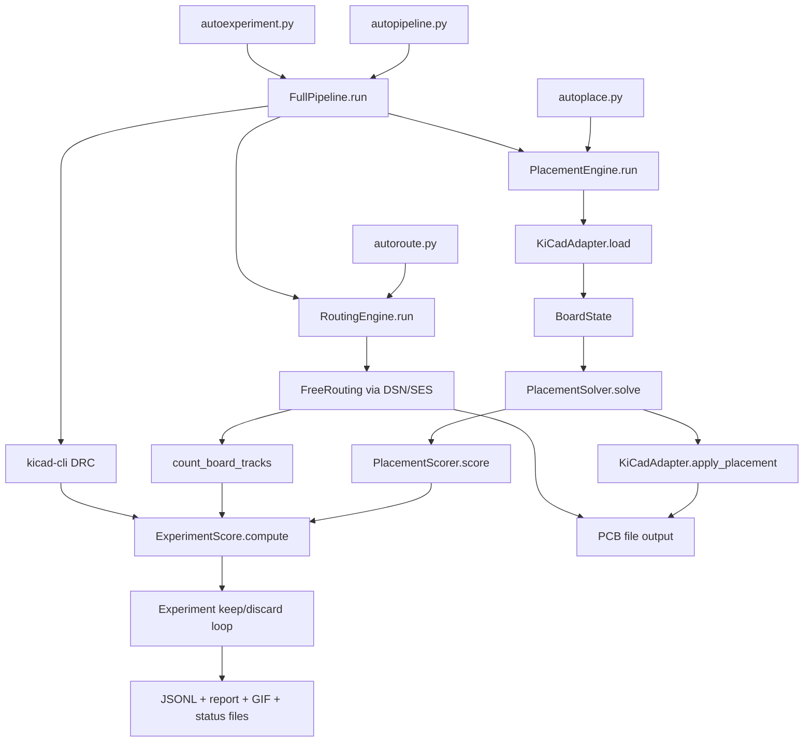
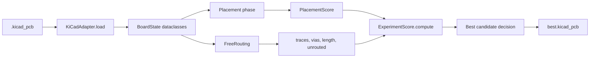

# LLUPS Autoplacer Architecture

This document describes how the autoplacer stack operates.

## High-Level System Map

## Layer Responsibilities

- `hardware/adapter.py` is the I/O boundary with KiCad (`pcbnew`): loads board state, applies placement.
- `brain/` modules are pure-Python algorithmic logic:
  - `placement.py`: footprint placement and placement scoring
  - `graph.py`: netlist graph analysis for placement grouping
  - `types.py`: shared dataclasses and scoring objects
- `freerouting_runner.py`: DSN export → FreeRouting CLI → SES import → track counting.
- `pipeline.py` composes placement + routing + DRC and emits `ExperimentScore`.
- `autoexperiment.py` runs iterative optimization rounds, keeps best board, writes artifacts.

## Data Model Path

