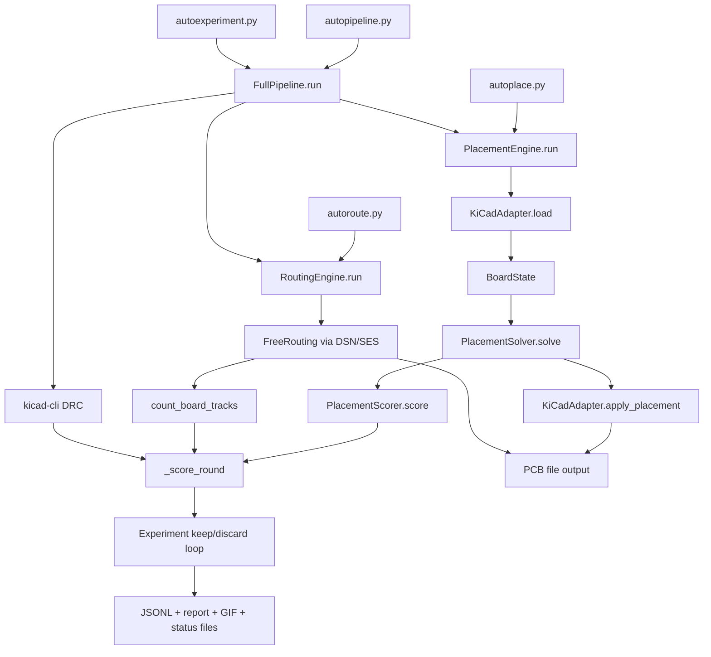
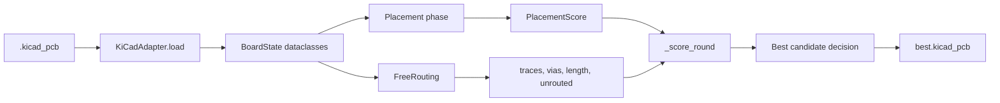

# LLUPS Autoplacer Architecture

This document describes how the autoplacer stack operates.

## High-Level System Map



## Layer Responsibilities

- `hardware/adapter.py` is the I/O boundary with KiCad (`pcbnew`): loads board state, applies placement.
- `brain/` modules are pure-Python algorithmic logic:
  - `placement.py`: footprint placement and placement scoring
  - `graph.py`: netlist graph analysis for placement grouping
  - `types.py`: shared dataclasses and scoring objects
- `freerouting_runner.py`: DSN export → FreeRouting CLI → SES import → track counting.
- `pipeline.py` composes placement + routing + DRC for single-board experiments.
- `autoexperiment.py` runs iterative optimization rounds, scores via `_score_round()`, keeps best board, writes artifacts.

## Data Model Path



## Configuration System

Configuration is split into two layers in `autoplacer/config.py`:

- **`DEFAULT_CONFIG`**: Generic defaults for any PCB project. Contains placement algorithm parameters (clearance, grid, forces), routing settings (timeout, passes, ignore nets), and feature toggles (scatter_mode, reheat, courtyard padding). Project-specific fields like `ic_groups`, `component_zones`, and `signal_flow_order` default to empty.
- **`LLUPS_CONFIG`**: Project-specific overrides for the LLUPS board. Contains IC groupings with thermal refs, component zone assignments (connectors→edges, batteries→center-bottom, mounting holes→corners), and signal flow ordering for ICs.

Configs are merged via `{**DEFAULT_CONFIG, **LLUPS_CONFIG, **(user_overrides or {})}` in both `pipeline.py` and `autoexperiment.py`.

### Key Config Features

| Config Key | Purpose |
|-----------|---------|
| `component_zones` | Maps refs to placement zones (edge, corner, zone constraints) |
| `signal_flow_order` | List of refs biased left→right along X-axis |
| `scatter_mode` | `"cluster"` (default) or `"random"` (uniform scatter) |
| `reheat_strength` | Temperature reheat factor at 50% of force sim iterations |
| `randomize_group_layout` | Enables variable cluster radii (0.3-1.8× vs 0.8-1.2×) |
| `courtyard_padding_mm` | Extra padding added to courtyard overlap scoring |
| `min_placement_score` | Minimum placement score to proceed to routing |
| `connector_gap_mm` | Gap between same-edge connectors (default 2.0mm) |
| `connector_edge_inset_mm` | Distance from board edge to connector body (default 1.0mm) |
| `orderedness` | Passive alignment strength 0.0-1.0 (organic → grid) |
| `pad_inset_margin_mm` | Minimum pad-to-board-edge distance (default 0.3mm) |
| `max_placement_iterations` | Force sim iteration limit (default 300, searchable 100-500) |
| `placement_convergence_threshold` | Displacement threshold to declare convergence (default 0.5mm) |
| `tht_backside_min_area_mm2` | THT area threshold for back-layer assignment (default 50mm²) |
| `board_size_overhead_factor` | Min board area = component area × factor (default 2.5) |
| `enable_board_size_search` | Enable board dimension search in autoexperiment |
| `smt_opposite_tht` | Attract front-side SMT components toward back-side THT shadows (default True) |
| `align_large_pairs` | Force large similarly-sized component pairs side-by-side (default True) |
| `unlock_all_footprints` | Allow edge/corner-pinned components to move freely during force sim (default True) |
| `skip_gnd_routing` | Exclude GND net from FreeRouting, rely on copper zone pour (default True) |

## Rotation & Flip Conventions

KiCad uses a clockwise rotation convention for `SetOrientationDegrees()`:

```
x' = lx·cos(θ) + ly·sin(θ) + cx
y' = -lx·sin(θ) + ly·cos(θ) + cy
```

where `(lx, ly)` are local pad offsets and `(cx, cy)` is the component center. The model's `_update_pad_positions()` must use this formula (not the standard CCW math convention).

KiCad's `Flip()` negates pad X offsets relative to the component center. When `_assign_layers()` moves a component to B.Cu, it must mirror pad positions: `pad.x = 2·comp.x - pad.x`.

## Evolutionary Optimization

`autoexperiment.py` runs an evolutionary loop with three mutation modes:

- **MINOR**: Gaussian perturbation from best config, reuses best seed
- **MAJOR**: Uniform sampling (aggressive), new seed, optional scatter and group randomization
- **EXPLORE**: Random config + seed, forced scatter mode (33% of batch)

Cross-run learning via **elite archive**: top-5 configs saved to `elite_configs.json`, seeded into 30% of early batches in subsequent runs.

A **placement validation gate** skips routing when:
- Any pads are outside the board boundary (zero tolerance)
- Placement score falls below `min_placement_score`
- Board containment below `min_board_containment`
- Courtyard overlap score below `min_courtyard_overlap_score`


## Theory of Operation

> *Extracted from the autoplacer internal technical reference.*

### Placement Pipeline (14 Steps)

The `PlacementSolver.solve()` method runs the following pipeline in order:

| Step | Name | Description |
|------|------|-------------|
| 0.5 | **Assign layers** | Place large THT components on B.Cu, SMT on F.Cu. Uses `tht_backside_min_area_mm2` threshold. |
| 1 | **Pin edge components** | Snap connectors and mounting holes to their assigned board edges/corners. Applies `edge_jitter_mm` for diversity. |
| 1.3 | **Align large pairs** | Detect pairs of large, similar-sized components (e.g. BT1+BT2) and force side-by-side alignment on one axis. |
| 2 | **Cluster by connectivity** | Run community detection on the net connectivity graph to find natural component clusters. IC groups boost intra-group edge weights. |
| 3 | **Initial cluster placement** | Place cluster centroids on the board using signal flow order (left-to-right) with seeded jitter. Scatter mode controls initial distribution. |
| 4 | **Intra-cluster optimization** | Run a short force-directed simulation within each cluster to arrange members compactly. |
| 5 | **Rotation optimization** | Try 4 rotations (0°, 90°, 180°, 270°) for each IC/connector, keeping whichever minimizes net crossing estimates. |
| 6 | **Force-directed refinement** | Main iterative loop: attraction along nets, repulsion between overlapping bounding boxes, cooling schedule. Scores every N iterations and reverts to best on stagnation. Includes mid-run temperature reheat. |
| 7 | **Swap optimization** | Greedily swap positions of similarly-sized unlocked components to minimize ratsnest crossings. Up to 5 rounds. |
| 8 | **Grid snap** | Snap component positions to `placement_grid_mm` grid. |
| 8.5 | **Orderedness** | Blend passive positions toward neat row/column alignment. Strength controlled by `orderedness` parameter (0.0–1.0). |
| 9 | **Overlap resolution** | Exhaustive push-apart of any remaining courtyard overlaps. |
| 10–12 | **Clamp & validate** | Hard-clamp all components inside the board outline, then verify every electrical pad is within the boundary (up to 3 passes). |
| 13 | **Restore pinned positions** | Re-pin edge/corner components that may have drifted during overlap resolution. Re-resolve overlaps, then re-pin again. |

### Experiment Loop (4 Phases)

The `autoexperiment.py` outer loop runs each round through four phases:

```
/dev/null/pipeline.txt#L1-8
┌─────────────┐     ┌──────────────┐     ┌───────────┐     ┌──────────┐
│  Placement   │────▶│   Routing    │────▶│    DRC    │────▶│ Scoring  │
│  (solver)    │     │ (FreeRouting)│     │  (KiCad)  │     │ (unified)│
└─────────────┘     └──────────────┘     └───────────┘     └──────────┘
     ~1-3s               ~10-30s             ~1-2s             <1s
```

1. **Placement** — `PlacementSolver.solve()` arranges components on the
   board. If the placement score is below `min_placement_score`, routing
   is skipped entirely (saves 15–30 s on degenerate layouts).

2. **Routing** — Export to DSN, run FreeRouting (Java), import SES result.
   FreeRouting auto-routes all nets with up to `freerouting_max_passes`
   passes within `freerouting_timeout_s`.

3. **DRC** — `quick_drc()` runs KiCad's design rule checker and counts
   shorts, unconnected nets, clearance violations, and courtyard overlaps.

4. **Scoring** -- `_score_round()` in `autoexperiment.py` produces a composite
   metric combining leaf acceptance, routed copper, parent composition,
   parent quality, and area compactness (max 89 absolute + improvement bonuses).

### Scoring System

The subcircuit experiment scorer (`_score_round()`) combines bounded absolute
components plus improvement bonuses:

| Component | Max Points | What it measures |
|-----------|--------|------------------|
| `leaf_acceptance` | 30 | Fraction of leaf subcircuits accepted |
| `routed_copper` | 16 | Trace and via coverage across accepted leaves |
| `parent_composition` | 8 | Whether parent compose succeeded |
| `parent_routed` | 12 | Whether parent routing ran |
| `parent_quality` | 14 | Preserved child copper + added parent copper |
| `area_compactness` | 9 | Child area / parent board area ratio |

**Hard score gates** prevent misleading totals:
- Route completion ≤ 50% → score capped at 40
- Route completion < 90% → score capped at 70

The inner `PlacementScore` (used within placement before routing) has its
own weight distribution:

| Component | Weight | Description |
|-----------|--------|-------------|
| `net_distance` | 0.22 | Connected components close together |
| `crossover_score` | 0.18 | Fewer ratsnest crossings |
| `board_containment` | 0.12 | All pads/bodies inside board |
| `edge_compliance` | 0.10 | Connectors/holes on edges |
| `courtyard_overlap` | 0.10 | No overlapping courtyards |
| `smt_opposite_tht` | 0.10 | SMT on opposite side of THT |
| `group_coherence` | 0.10 | Functional groups stay compact |
| `aspect_ratio` | 0.05 | Penalize elongated boards |
| `compactness` | 0.02 | Tighter layouts |
| `rotation_score` | 0.01 | Pad alignment quality |

### Evolutionary Search Strategy

The experiment loop uses an evolutionary search with five mutation modes:

1. **Minor mutation** — Gaussian perturbation of 1–3 continuous parameters
   around the current best config. Uses the same seed as the best (exploit).
   Board dimensions have a 70% shrink bias.

2. **Major mutation** — Uniform resampling of parameters across full ranges,
   fresh seed, enables `randomize_group_layout` and `reheat_strength`.
   Triggered after `--plateau` consecutive minor rounds without improvement.

3. **Explore** — Fully random config from baseline (not from best).
   Always uses `scatter_mode: "random"` and `randomize_group_layout: True`.
   ~33% of each batch is reserved for exploration.

4. **Elite injection** — In early rounds (< 10), explore slots are replaced
   with configs from the elite archive (cross-run learning) paired with
   fresh seeds. Exploits knowledge from previous experiment runs.

5. **Seed bank** — Top-performing configs are saved to `seed_bank.json`
   across runs. Loaded at startup and injected alongside the elite archive
   for warm-starting new experiments.

**Guardrails** applied to all mutations:
- Aspect ratio capped at 2:1 in either direction
- Board area capped at 2× minimum viable area
- `placement_clearance_mm` floor at 2.0 mm
- Board dimensions rounded to 5 mm steps

### Hierarchical Group Placement

The system uses a three-level hierarchy:

1. **Intra-group placement** (`solve_group()`) — Each functional group
   (e.g., "U2 + C2, C3, C4, R3–R8, RT1, D1, D2") is placed independently
   on a virtual mini-board. The IC is centered, supporting passives are
   arranged around it using force-directed simulation with strong
   intra-group net attraction. Result: a `PlacedGroup` with relative
   component positions and a bounding box.

2. **Inter-group placement** — Groups are treated as rigid blocks and
   placed on the real board using the same force-directed + cluster
   pipeline. Signal flow order biases groups left-to-right.

3. **Post-processing** — After groups are stamped onto the board, global
   passes handle alignment (`_align_large_pairs`), overlap resolution,
   grid snap, orderedness, and edge clamping. Pinned edge components
   are restored to their assigned positions.

**Special case: all-THT groups** (e.g., BT1+BT2) skip group placement
entirely because their large footprints create oversized rigid blocks.
Instead, they are placed individually and aligned by `_align_large_pairs()`.

---


## Experimental Analysis (13-Round Study)

> *Historical findings from the first comprehensive autoplacer validation run.*

### Key Metrics from 13-Round Experiment

| Metric | Value |
|---|---|
| Best score | 79.7 |
| Board dimensions | 120 × 85 mm |
| Board area | 10,200 mm² (17% smaller than 85 × 145 mm baseline) |
| Nets routed | 26/26 (100%) |
| Shorts | 0 |
| Clearance violations | 14 |
| FreeRouting crashes | 0 |

All 13 rounds completed successfully — no FreeRouting crashes, no Python
exceptions, and every round achieved 100% net routing.

### Root Causes Identified & Fixed

1. **Battery group rigid block** — BT1 + BT2 created a 115 mm wide rigid
   block because the group placer treated them as a single unit. Fixed by
   skipping group placement for all-THT groups; alignment is instead handled
   by `_align_large_pairs()` post-processing, which places them side-by-side
   without locking them into an inflexible block.

2. **Subprocess Python resolution** — Worker subprocesses used `"python3"`
   which resolved to a virtualenv Python that lacked pcbnew bindings. Fixed
   by using `sys.executable` so workers always use the same interpreter as
   the parent process.

3. **Board size compute too aggressive** — Margins and area caps were too
   large, producing boards far bigger than necessary. Reduced `block_margin`
   from 8 → 4 mm, `max_cap` from 150 → 120 mm, and tightened the overhead
   factor.

4. **Explore mode catastrophic failures** — Random configs generated boards
   as large as 195 × 110 mm because there were no guardrails on aspect ratio
   or total area. Fixed with `_clamp_board_guardrails()`: max 2:1 aspect
   ratio, area capped at 2× minimum viable area, and 5 mm step rounding.

5. **Scoring blind spots** — The scoring system had no aspect ratio penalty
   (allowing long, thin boards) and no trace length efficiency metric. Added
   `aspect_ratio` to `PlacementScore` (penalizes boards elongated beyond
   ~1.5:1) and `trace_length_score` to the experiment scoring (rewards shorter
   total trace length relative to an MST estimate).

6. **DSN clearance patch incomplete** — Only `smd_smd` clearance was patched
   in the DSN export. Now patches ALL clearance type overrides (`smd_smd`,
   `smd_to_turn_gap`, `smd_to_via_gap`, `via_to_via_gap`, etc.) so
   FreeRouting respects the design rules uniformly.

### Persistent Issues (14 Clearance Violations)

- 14 clearance violations remain in every successful round.
- **Root cause:** KiCad's DRC rules enforce 0.2 mm trace clearance, but
  FreeRouting routes with its own internal clearance model which is less
  strict in certain geometries.
- These are likely smd-to-trace or trace-to-trace clearances at pin escape
  points that FreeRouting doesn't optimize for.
- **Potential fixes:**
  - Increase trace clearance in FreeRouting rules (DSN header) to 0.25 mm.
  - Post-routing DRC-driven nudging: run KiCad DRC, parse violation
    locations, nudge offending traces by 0.05–0.1 mm.
  - Widen the DSN clearance class overrides beyond the KiCad minimums to
    give FreeRouting more margin.

---


## Optimal Parameter Regions

The following parameter ranges consistently produce the best results
(scores 70+, 26/26 nets routed, minimal DRC violations):

| Parameter | Optimal Range | Notes |
|-----------|--------------|-------|
| `placement_clearance_mm` | ~3.0 mm | Too low (< 2.0) causes courtyard overlaps; too high wastes board space |
| `force_attract_k` | 0.02–0.04 | Attraction strength along nets. Higher pulls connected components together more aggressively |
| `force_repel_k` | 150–200 | Repulsion between overlapping bounding boxes. Too high causes oscillation; too low allows overlaps |
| `cooling_factor` | 0.92–0.97 | Damping multiplier per iteration. Lower cools faster (risks local minima); higher allows more exploration |
| `max_placement_iterations` | 300–360 | More iterations help on complex boards but hit diminishing returns past ~400 |
| `orderedness` | 0.7–0.8 | High values produce neat rows/columns that route cleanly. 1.0 is too rigid; 0.0 is too chaotic |
| `scatter_mode` | `"random"` | Random initial scatter outperforms cluster-based seeding for this board topology |
| `edge_margin_mm` | 5–7 mm | Margin from board edge for non-edge-pinned components. Leaves room for edge routing channels |
| `board_width_mm` | 115–125 mm | For LLUPS specifically; determined by component count and battery holder width |
| `board_height_mm` | 80–90 mm | For LLUPS specifically; enough vertical space for signal flow groups |
| `reheat_strength` | 0.05–0.15 | Moderate reheat helps escape local minima at the halfway point |
| `connector_edge_inset_mm` | 0.5–1.5 mm | Slight inset from edge for connectors |

### Anti-patterns (what does NOT work)

- `placement_clearance_mm` < 2.0 — causes unresolvable courtyard overlaps.
- `force_repel_k` > 400 — components oscillate and never converge.
- `orderedness` = 0.0 with `scatter_mode: "cluster"` — organic layouts
  that FreeRouting struggles to route cleanly.
- Board aspect ratio > 2:1 — long thin boards waste area and create
  long traces.
- `max_placement_iterations` < 100 — not enough iterations for the
  force simulation to converge.

---

### Anti-patterns (what does NOT work)

- `placement_clearance_mm` < 2.0 — causes unresolvable courtyard overlaps.
- `force_repel_k` > 400 — components oscillate and never converge.
- `orderedness` = 0.0 with `scatter_mode: "cluster"` — organic layouts
  that FreeRouting struggles to route cleanly.
- Board aspect ratio > 2:1 — long thin boards waste area and create
  long traces.
- `max_placement_iterations` < 100 — not enough iterations for the
  force simulation to converge.

---


## Observability Model

> *Describes how board artifacts and diagnostics should be structured
> for both human and machine review.*

### Board-first observability direction

For hierarchical and subcircuit work, KiCad board files should remain the visual source of truth.

That means:

- persist meaningful `.kicad_pcb` stage snapshots first
- derive preview PNGs from those persisted boards
- expose the board paths anywhere previews are shown
- keep machine-readable summaries aligned with those board artifacts

### Current observability expectations

For accepted leaf artifacts, the preferred canonical set is:

- `solved_layout.json`
- `leaf_pre_freerouting.kicad_pcb`
- `leaf_routed.kicad_pcb`

For candidate-round observability, the preferred round-specific set is:

- `round_000N_leaf_pre_freerouting.kicad_pcb`
- `round_000N_leaf_routed.kicad_pcb`
- round-specific preview image paths
- machine-readable routing outcome fields such as:
  - router
  - reason
  - failed / skipped
  - routed internal nets
  - failed internal nets
  - routed copper summary

For parent observability, the preferred canonical set is:

- `parent_pre_freerouting.kicad_pcb`
- `parent_routed.kicad_pcb`
- `solved_layout.json`

### Why this matters

Human review needs to answer:

- what exact board file produced this preview?
- what stage is this board from?
- did this round route, fail, or get skipped?

Machine review needs to answer:

- which nets failed?
- what router outcome was recorded?
- which persisted board artifact corresponds to that outcome?

### Recommended next observability work

1. Extend the same explicit board-path observability model across parent-stage artifacts.
2. Ensure every meaningful parent stage persists a `.kicad_pcb` before rendering previews.
3. Keep live status payloads and analysis views aligned with persisted board paths rather than PNG-only assumptions.
4. Add richer machine-readable summaries for parent composition and parent routing transitions.
5. Prefer stage-specific board snapshots over shared artifact-level previews whenever candidate-round inspection is involved.

