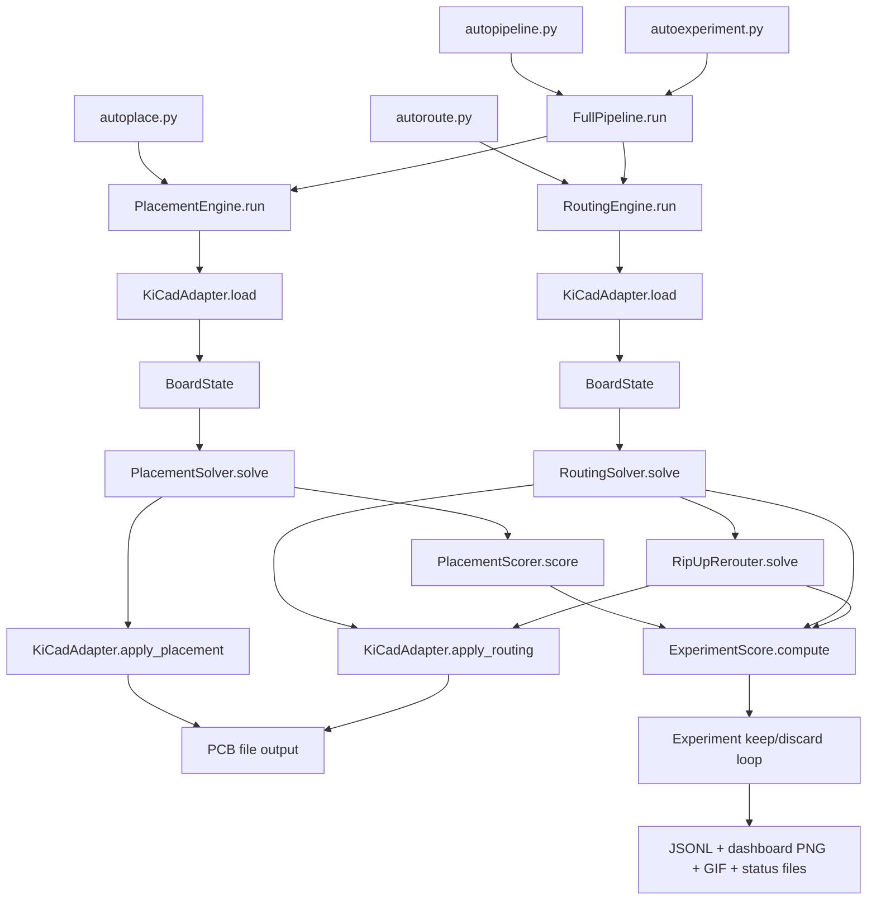
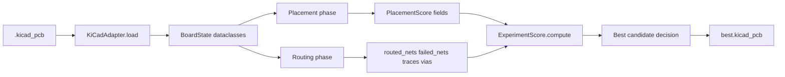

# LLUPS Autoplacer Architecture

This document describes how the current autoplacer stack operates in code.

## High-Level System Map

## Layer Responsibilities

- `hardware/adapter.py` is the I/O boundary with KiCad (`pcbnew`): load board state, apply placement, apply routing.
- `brain/` modules are pure-Python algorithmic logic:
  - `placement.py`: footprint placement and placement scoring
  - `router.py`: A* routing, net prioritization, MST-based per-net routing
  - `conflict.py`: rip-up/reroute when initial routing fails
  - `types.py`: shared dataclasses and scoring objects
- `pipeline.py` composes placement + routing and emits `ExperimentScore`.
- `autoexperiment.py` runs iterative optimization rounds, applies shorts penalty, keeps best board, and writes dashboard artifacts.

## Data Model Path

