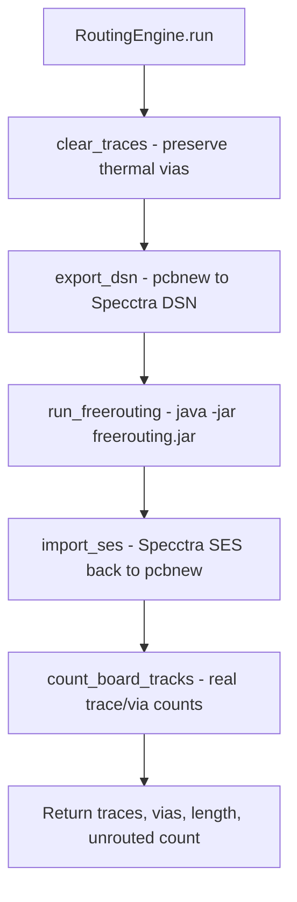
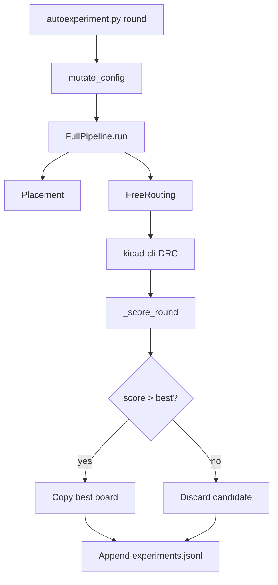

# Auto-Trace: FreeRouting Integration

This page describes how automatic routing works in the LLUPS pipeline.

## Routing Engine

Routing uses [FreeRouting](https://github.com/freerouting/freerouting), a Java-based
topological PCB autorouter, via DSN/SES file exchange.

**Prerequisites:**
- Java JRE 21+ (`java -version`)
- FreeRouting JAR at `~/.local/lib/freerouting-1.9.0.jar` (v2.1.0 has a regression where max_passes is ignored)
- `kicad-cli` (ships with KiCad 9)

## Routing Pipeline

### Key files

| File | Purpose |
|------|---------|
| `autoplacer/freerouting_runner.py` | DSN export, FreeRouting CLI, SES import, track counting |
| `autoplacer/pipeline.py` | Orchestrates placement → routing → DRC |
| `autoplacer/config.py` | Default config (timeouts, max passes, thermal refs) |

## Routing Rules

- **Thermal vias** for U2/U4 are preserved during `clear_traces()` — not re-routed.
- **GND** is skipped from routing (`skip_gnd_routing=True`) — handled as copper zones.
- FreeRouting runs single-threaded (`-mt 1`) with up to 40 passes by default.
- Timeout: 120 seconds per routing attempt.

## Auto-Trace + Experiment Loop

## Error Handling

- If FreeRouting fails to produce a SES file, a `RuntimeError` is raised (not silently ignored).
- Worker crashes are captured with full tracebacks and printed to stdout.
- DRC errors from `kicad-cli` include the error message in the returned dict.
