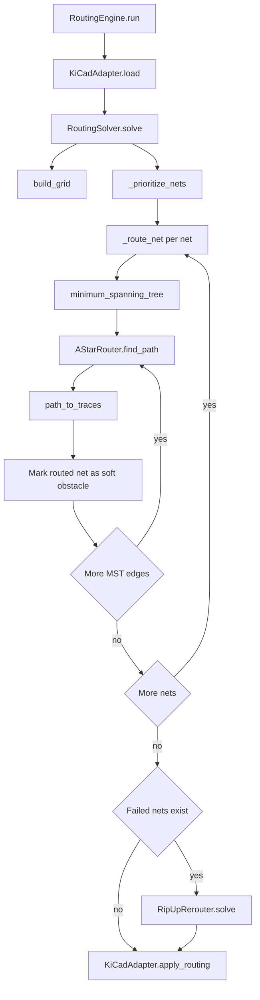
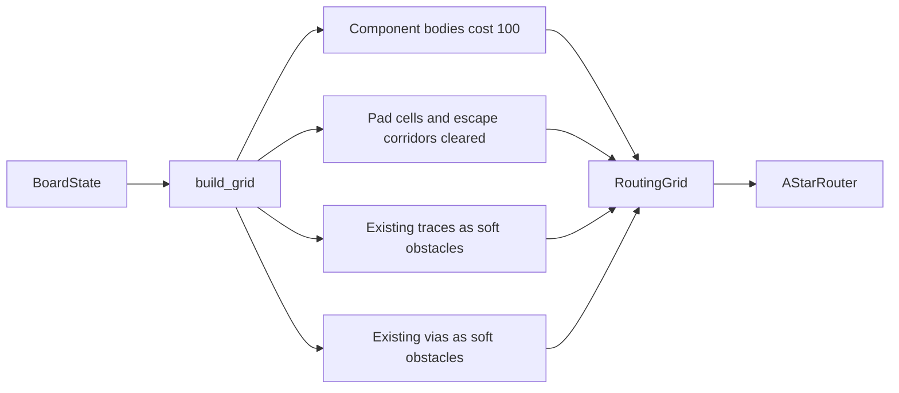
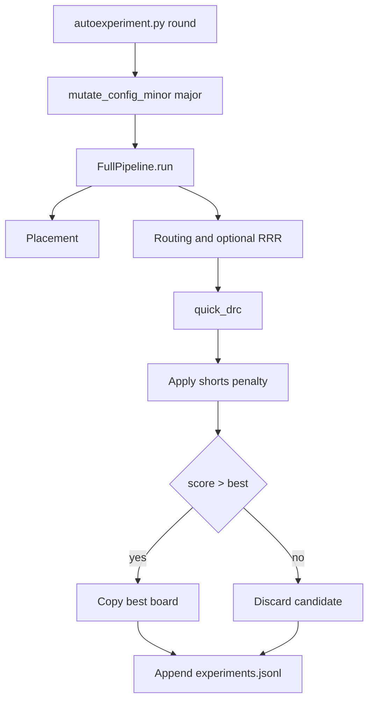

# Auto-Trace Internals

This page describes the implemented auto-tracing behavior in:

- `autoplacer/brain/router.py`
- `autoplacer/brain/grid_builder.py`
- `autoplacer/brain/conflict.py`

## End-to-End Routing Flow

## Routing Rules and Constraints

- Net ordering:
  - power nets first
  - higher `priority` first
  - simpler nets (fewer pads) earlier
- GND can be skipped (`skip_gnd_routing=True`).
- Nets with fewer than 2 pads are skipped.
- Width occupancy uses conservative grid cells: `ceil((width + clearance)/resolution)`.
- Optional width fallback can use relaxed width (`allow_width_relaxation`).
- Cross-net segments and vias are hard-blocked with cost `1e6`.
- Existing routed geometry is soft-costed (default `existing_trace_cost=100.0`).
- A* applies direction bias:
  - Front layer prefers horizontal
  - Back layer prefers vertical
- Via transition penalty is `VIA_COST=8.0`.
- Search is capped by `max_search`.

## Grid Cost Model

## Rip-Up/Reroute Behavior

When initial A* pass fails on some nets:

- `RipUpRerouter.solve()` starts from failed-net queue.
- Builds a component-only base grid, then overlays current routed geometry as hard blocks.
- Attempts to route blocked net.
- If blocked, chooses victim nets via `_find_victims()` using:
  - shorter routed length preferred
  - lower net priority preferred
  - fewer prior rip attempts preferred
- Rips up selected victims, retries blocked net, and requeues victims.
- Stops on success, stagnation, max iterations, or timeout.

## Auto-Trace + Experiment Loop Interaction

