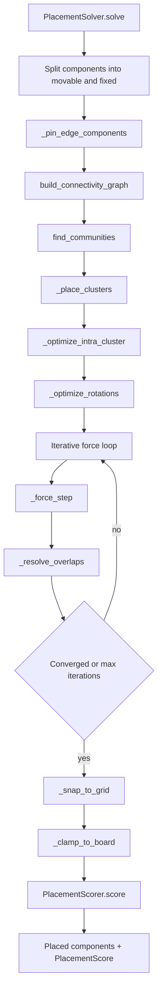
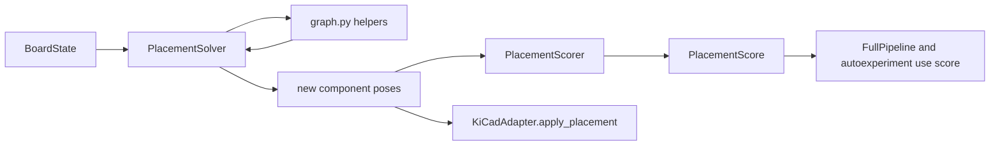

# Footprint Layout Flow

This page documents how footprint placement currently works in `autoplacer/brain/placement.py`.

## Placement Pipeline

## Main Placement Rules

- Edge pinning is applied first for `connector` and `mounting_hole` parts.
- Locked parts are preserved and excluded from move/rotation operations.
- Clustering is driven by net connectivity communities.
- Overlaps are resolved with configurable clearance (`placement_clearance_mm`).
- Final positions are grid-snapped (`placement_grid_mm`) and clamped to board outline.

## Placement Scoring Breakdown

`PlacementScorer.score()` computes these 0-100 metrics:

- `net_distance`: based on total ratsnest/MST length relative to board-diagonal worst case.
- `crossover_score`: from estimated crossing count normalization.
- `compactness`: board fill ratio with a gentle reward curve.
- `edge_compliance`: percent of edge components near board perimeter.
- `rotation_score`: orientation quality (full/partial credit by type/angle).
- `board_containment`: penalties for pads/bodies outside the board.
- `courtyard_overlap`: overlap-count penalties.

Then `PlacementScore.compute_total()` applies default weights:

- `net_distance`: 0.25
- `crossover_score`: 0.30
- `compactness`: 0.02
- `edge_compliance`: 0.05
- `rotation_score`: 0.03
- `board_containment`: 0.20
- `courtyard_overlap`: 0.15

## Placement Interaction Diagram

