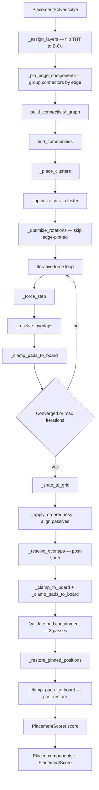
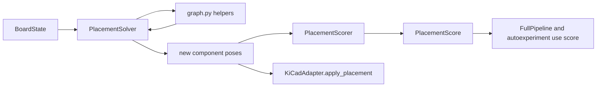

# Footprint Layout Flow

This page documents how footprint placement currently works in `autoplacer/brain/placement.py`.

## Placement Pipeline



## Type-Aware Placement

### Component Zones

Components can be assigned to placement zones via `config["component_zones"]`:

```python
component_zones = {
    "J1": {"type": "edge", "edge": "left"},      # USB-C on left edge
    "J2": {"type": "edge", "edge": "right"},      # Output on right edge
    "BT1": {"type": "zone", "zone": "center-bottom"},  # Batteries centered
    "H4": {"type": "corner", "corner": "top-left"},     # Mounting holes in corners
}
```

Zone types:
- **`edge`**: Component pinned to board edge (left/right/top/bottom) with 2mm inset
- **`corner`**: Component placed 5mm from corner (top-left/top-right/bottom-left/bottom-right)
- **`zone`**: Component placed within a named zone region (center, center-bottom, top-left, etc.)

Unassigned connectors and mounting holes fall back to heuristic edge/corner placement.

### Signal Flow Ordering

`config["signal_flow_order"]` biases IC placement left→right along the X-axis. A 60/40 blend of flow-position and cluster position creates natural signal flow while respecting connectivity.

### Decoupling Cap Proximity

Capacitors listed in `ic_groups` (e.g., `{"refs": ["U1", "C1", "C2"]}`) are placed at 1.5× clearance radius from their parent IC, maintaining close decoupling.

### Connector Edge Grouping

Connectors assigned to the same edge (via `component_zones` or nearest-edge heuristic) are placed as a compact group:

- Sorted by descending size (largest connector first)
- Placed in a column (left/right edges) or row (top/bottom edges)
- Spaced by `connector_gap_mm` (default 2.0mm)
- Auto-oriented via `_best_rotation_for_edge()` so pads face the board center
- For symmetric footprints (e.g. USB-C), uses body aspect ratio: long axis parallel to the edge
- Edge-pinned connectors are excluded from `_optimize_rotations()` to preserve their orientation

#### Body-Edge-Flush Positioning

Connectors are positioned so their body edge is flush with the board edge (plus a configurable `connector_edge_inset_mm` offset, default 1.0mm). Unlike general components which use `edge_margin_mm` from center, connectors compute position from their body extent:

- Left edge: `x = board_left + connector_inset + body_width/2`
- Right edge: `x = board_right - connector_inset - body_width/2`
- Top/bottom edges: same pattern for Y axis

`_shift_pads_inside()` respects the assigned edge — it only shifts the component on the 3 non-assigned sides, so connectors aren't pulled away from their edge.

### Layer Assignment

Large through-hole components (area > `tht_backside_min_area_mm2`, default 50mm²) are assigned to B.Cu. When flipping:
- Pad X offsets are mirrored: `pad.x = 2·comp.x - pad.x`
- Layer assignment runs BEFORE edge pinning so connector positions account for flipped geometry

SMT components always stay on F.Cu, even when their IC group contains back-layer THT parts. The IC group connectivity edges (weight 2.0) in the force simulation keep SMT passives near their THT group leaders in the same XY region, achieving dual-sided board usage without flipping SMT to the back.

### Orderedness

`config["orderedness"]` (0.0-1.0) controls passive alignment strength:
- 0.0 = organic placement (default)
- 1.0 = full grid alignment near IC group leaders
- Intermediate values blend organic position with grid position
- Passives are grouped by their IC group leader, sorted by size class, and arranged into rows

## Scatter Mode

`config["scatter_mode"]` controls initial placement:
- **`"cluster"`** (default): Force-directed cluster placement based on connectivity
- **`"random"`**: Uniform random positions within board bounds — useful for explore candidates to escape local optima

## Temperature Reheat

At 50% of force simulation iterations, the solver reheats:
- Temperature resets to `reheat_strength × initial_temperature`
- Damping resets to 0.7
- State dedup cache is cleared

This helps the force simulation escape local minima in the placement landscape.


## Main Placement Rules

- Edge pinning is applied first for `connector` and `mounting_hole` parts.
- Locked parts are preserved and excluded from move/rotation operations.
- Clustering is driven by net connectivity communities.
- Overlaps are resolved with configurable clearance (`placement_clearance_mm`).
- Final positions are grid-snapped (`placement_grid_mm`) and clamped to board outline.

## Placement Scoring Breakdown

`PlacementScorer.score()` computes these 0-100 metrics:

- `net_distance`: based on total ratsnest/MST length relative to board-diagonal worst case.
- `crossover_score`: from estimated crossing count normalization.
- `compactness`: board fill ratio with a gentle reward curve.
- `edge_compliance`: percent of edge components near board perimeter.
- `rotation_score`: orientation quality (full/partial credit by type/angle).
- `board_containment`: penalties for pads/bodies outside the board.
- `courtyard_overlap`: overlap-count penalties.

Then `PlacementScore.compute_total()` applies default weights:

- `net_distance`: 0.25
- `crossover_score`: 0.30
- `compactness`: 0.02
- `edge_compliance`: 0.05
- `rotation_score`: 0.03
- `board_containment`: 0.20
- `courtyard_overlap`: 0.15

## Placement Interaction Diagram




