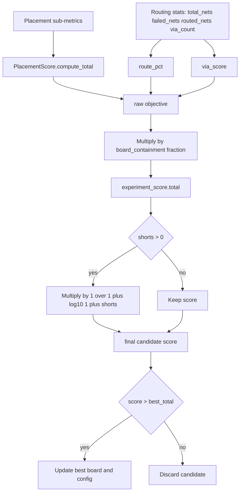

# Scoring: Placement, Routing, and Final Selection

This document explains the active scoring paths and formulas in the current codebase.

## Two Distinct Scoring Systems

- `score_layout.py` (static QA scorer): reports weighted check categories for a PCB file.
- `autoexperiment.py` + `ExperimentScore.compute()` (optimizer objective): used to accept/discard candidates and choose best board.

They are related but not identical.

## PlacementScore (pre-routing quality signal)

`PlacementScorer.score()` emits sub-metrics, then `PlacementScore.compute_total()` aggregates:

```text
placement_total =
  0.25*net_distance +
  0.30*crossover_score +
  0.02*compactness +
  0.10*edge_compliance +
  0.03*rotation_score +
  0.15*board_containment +
  0.15*courtyard_overlap
```

All terms are normalized to a 0-100 range by scorer functions.

## Placement Validation Gate

Before routing, the pipeline applies zero-tolerance checks:
- `pads_outside_board > 0` → **rejected** (any pad outside board boundary)
- `score < min_placement_score` → rejected
- `board_containment < min_board_containment` → rejected
- `courtyard_overlap < min_courtyard_overlap_score` → rejected

## Final ExperimentScore Formula (optimizer objective)

`ExperimentScore.compute()` currently computes:

```text
route_pct = ((total_nets - failed_nets) / total_nets) * 100    # if total_nets > 0 else 100
via_score = clamp(100 - (via_count / routed_nets)*20, 0..100)  # if routed_nets > 0 else 50

raw =
  0.15*placement_total +
  0.65*route_pct +
  0.10*via_score +
  0.10*50

final = raw * (board_containment / 100)
```

Then `autoexperiment.py` applies extra shorts penalty:

```text
if shorts > 0:
  final *= 1 / (1 + log10(1 + shorts))
```

## Detailed Scoring Flow Diagram



## Selection and Dashboard Outputs

In each autoexperiment round:

- candidate score is computed and penalty-adjusted
- round is marked kept/discarded
- results append to `.experiments/experiments.jsonl`
- best board is copied to `.experiments/best/best.kicad_pcb`
- dashboard PNG and progress GIF are generated from run artifacts

## Notes on Documentation Drift

If formulas in top-level docs diverge from implementation, prefer:

- `autoplacer/brain/types.py` for placement and experiment objective math
- `autoexperiment.py` for post-score penalties and keep/discard policy
