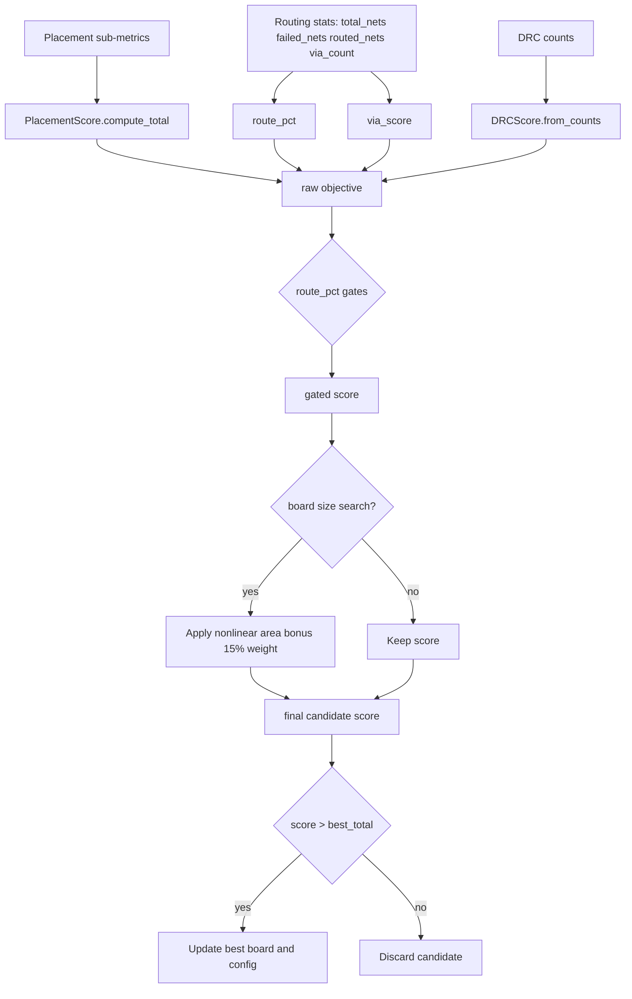

# Scoring: Placement, Routing, and Final Selection

This document explains the active scoring paths and formulas in the current codebase.

## Two Distinct Scoring Systems

- `score_layout.py` (static QA scorer): reports weighted check categories for a PCB file.
- `autoexperiment.py` + `_score_round()` (optimizer objective): used to accept/discard candidates and choose best board.

They are related but not identical.

## PlacementScore (pre-routing quality signal)

`PlacementScorer.score()` emits sub-metrics, then `PlacementScore.compute_total()` aggregates:

```text
placement_total =
  0.25*net_distance +
  0.20*crossover_score +
  0.10*compactness +
  0.10*edge_compliance +
  0.03*rotation_score +
  0.15*board_containment +
  0.12*courtyard_overlap +
  0.05*smt_opposite_tht
```

All terms are normalized to a 0-100 range by scorer functions.

### SMT-Opposite-THT Scoring

Measures the fraction of front-side SMT component area that overlaps (in XY
projection) with back-side THT bounding boxes. Higher overlap means better
dual-sided board space utilization. Returns 100 when feature is disabled or no
back-side THT exists; 50 baseline when SMT has no overlap; scales linearly to
100 at full coverage. Controlled by `smt_opposite_tht` config toggle.

### Courtyard Overlap Scoring

Uses area-proportional scoring instead of per-pair penalties:

```text
overlap_ratio = total_overlap_area / total_courtyard_area
courtyard_score = clamp(100 * (1 - overlap_ratio * 3), 0..100)
```

This provides a smooth gradient — partial improvements always improve the score. A 10% overlap ratio → score ~70; 30% → ~30; 0% → 100.

## Placement Validation Gate

Before routing, the pipeline applies zero-tolerance checks:
- `pads_outside_board > 0` → **rejected** (any pad outside board boundary)
- `score < min_placement_score` → rejected
- `board_containment < min_board_containment` → rejected
- `courtyard_overlap < min_courtyard_overlap_score` → rejected

If placement scores 0, the pipeline retries once with default force parameters before giving up.

## Subcircuit Experiment Scoring (_score_round)

The subcircuit pipeline uses `_score_round()` in `autoexperiment.py` directly
(the former `ExperimentScore` class has been removed). The score is composed of
bounded absolute components plus improvement bonuses:

```text
Score budget (absolute, max 89):
  leaf_acceptance       = acceptance_ratio * 30        (max 30)
  routed_copper         = trace_coverage*12 + via_coverage*4  (max 16)
  parent_composition    = 8 if compose succeeded       (max 8)
  parent_routed         = 12 if parent routing ran     (max 12)
  parent_quality        = preserved_traces*7 + preserved_vias*3
                          + added_copper*2 + copper_ratio*2   (max 14)
  area_compactness      = (child_area / parent_area) * 9      (max 9)

Improvement bonuses (relative to baseline and rolling average):
  baseline_improvement  = max(0, min(10, delta_vs_baseline * 0.6))
  recent_improvement    = max(0, min(4, delta_vs_recent * 1.0))
  plateau_escape        = up to 4 when breaking out of plateau
```

Area compactness rewards tighter parent boards -- higher child-to-board
area ratio means less wasted space.

## DRC Scoring

DRC violations are scored per-category with log-weighted penalties:

```text
score(count, weight) = weight * (1 - log10(1 + count) / log10(100))

shorts_score    = score(shorts, 40)     # heaviest weight
unconnected     = score(unconnected, 30)
clearance       = score(clearance, 20)
courtyard       = score(courtyard, 10)
drc_total = sum of all above  # 0-100 scale
```

## Detailed Scoring Flow Diagram



## Selection and Dashboard Outputs

In each autoexperiment round:

- candidate score is computed and penalty-adjusted
- round is marked kept/discarded
- results append to `.experiments/experiments.jsonl`
- best board is copied to `.experiments/best/best.kicad_pcb`
- dashboard PNG and progress GIF are generated from run artifacts

## Notes on Documentation Drift

If formulas in top-level docs diverge from implementation, prefer:

- `autoplacer/brain/types.py` for placement scoring types
- `autoexperiment.py` `_score_round()` for the experiment objective and keep/discard policy
