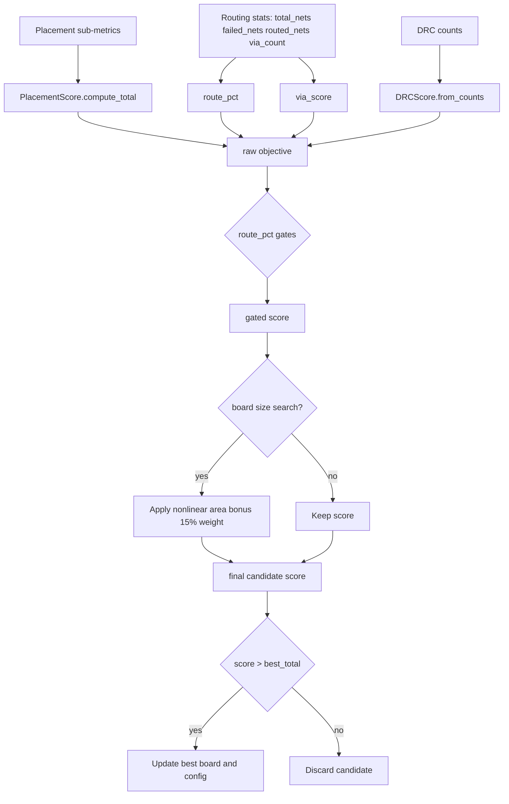

# Scoring: Placement, Routing, and Final Selection

This document explains the active scoring paths and formulas in the current codebase.

## Two Distinct Scoring Systems

- `score_layout.py` (static QA scorer): reports weighted check categories for a PCB file.
- `autoexperiment.py` + `ExperimentScore.compute()` (optimizer objective): used to accept/discard candidates and choose best board.

They are related but not identical.

## PlacementScore (pre-routing quality signal)

`PlacementScorer.score()` emits sub-metrics, then `PlacementScore.compute_total()` aggregates:

```text
placement_total =
  0.25*net_distance +
  0.20*crossover_score +
  0.12*compactness +
  0.10*edge_compliance +
  0.03*rotation_score +
  0.15*board_containment +
  0.15*courtyard_overlap
```

All terms are normalized to a 0-100 range by scorer functions.

### Courtyard Overlap Scoring

Uses area-proportional scoring instead of per-pair penalties:

```text
overlap_ratio = total_overlap_area / total_courtyard_area
courtyard_score = clamp(100 * (1 - overlap_ratio * 3), 0..100)
```

This provides a smooth gradient — partial improvements always improve the score. A 10% overlap ratio → score ~70; 30% → ~30; 0% → 100.

## Placement Validation Gate

Before routing, the pipeline applies zero-tolerance checks:
- `pads_outside_board > 0` → **rejected** (any pad outside board boundary)
- `score < min_placement_score` → rejected
- `board_containment < min_board_containment` → rejected
- `courtyard_overlap < min_courtyard_overlap_score` → rejected

If placement scores 0, the pipeline retries once with default force parameters before giving up.

## Final ExperimentScore Formula (optimizer objective)

`ExperimentScore.compute()` currently computes:

```text
route_pct = ((total_nets - failed_nets) / total_nets) * 100
via_score = clamp(100 - (via_count / routed_nets) * 20, 0..100)

drc_score = DRCScore.from_counts(drc_dict)  # log-weighted per-category

raw =
  0.15 * placement_total +
  0.50 * route_pct +
  0.10 * via_score +
  0.05 * board_containment +
  0.20 * drc_score

# Hard gates: cap score based on route completion
if route_pct <= 50%: raw = min(raw, 40)
if route_pct < 90%: raw = min(raw, 70)

# Area bonus (when board size search active):
area_score = 100 * exp(-board_area / (1.8 * ref_area))  # nonlinear
final = raw * 0.85 + 0.15 * area_score
```

Then `autoexperiment.py` applies extra shorts penalty:

```text
if shorts > 0:
  final -= min(15, shorts * 0.5)
```

## DRC Scoring

DRC violations are scored per-category with log-weighted penalties:

```text
score(count, weight) = weight * (1 - log10(1 + count) / log10(100))

shorts_score    = score(shorts, 40)     # heaviest weight
unconnected     = score(unconnected, 30)
clearance       = score(clearance, 20)
courtyard       = score(courtyard, 10)
drc_total = sum of all above  # 0-100 scale
```

## Detailed Scoring Flow Diagram



## Selection and Dashboard Outputs

In each autoexperiment round:

- candidate score is computed and penalty-adjusted
- round is marked kept/discarded
- results append to `.experiments/experiments.jsonl`
- best board is copied to `.experiments/best/best.kicad_pcb`
- dashboard PNG and progress GIF are generated from run artifacts

## Notes on Documentation Drift

If formulas in top-level docs diverge from implementation, prefer:

- `autoplacer/brain/types.py` for placement and experiment objective math
- `autoexperiment.py` for post-score penalties and keep/discard policy
